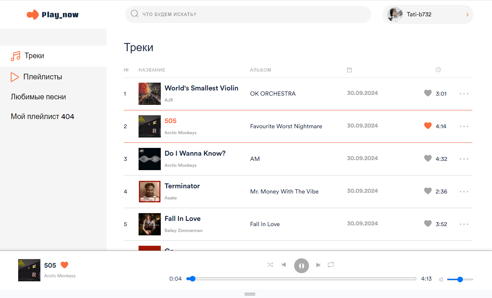
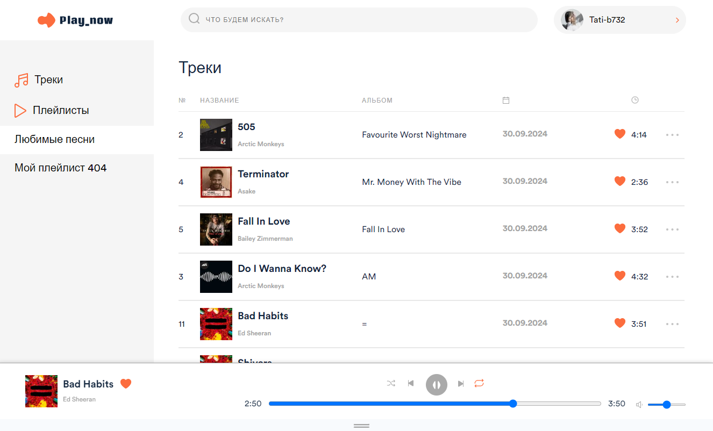
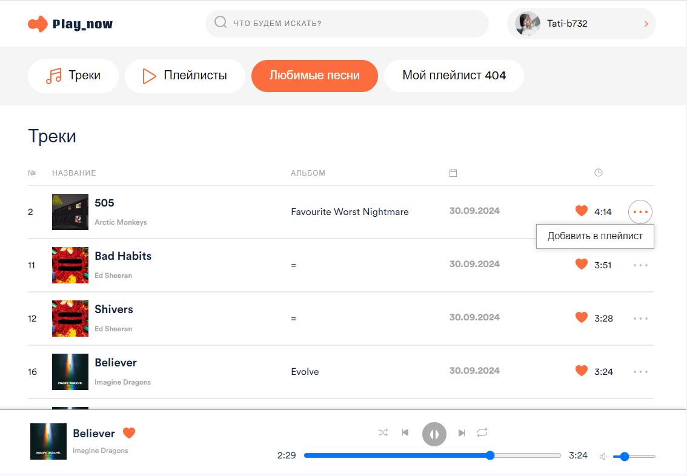
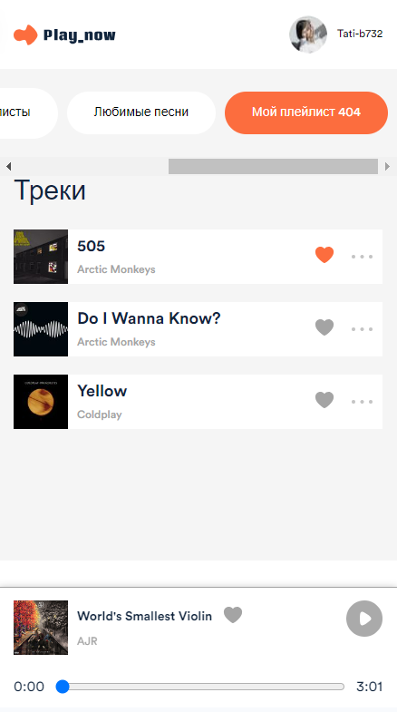

#PLAY NOW
Приложение для прослушивания музыки. Оно хранит аудиотреки и позволяет прослушивать плейлисты, а также воспроизводить музыку прямо в браузере

Реализованы следующие методы:

- добавление треков в плейлист
- удаление треков из плейлиста
- отметка "Мне нравится"
- прослушивание трека по клику на трек в списке треков
- перемотка skipback/skipnext
- переключение трека после завершения









## Инициализация BACKEND

Для инициализации необходимо отдельно скачать папку static, которая содержит статичные файлы БД. Папку необходимо разархивировать так, чтобы она была доступна по пути /BACKEND/static
Ссылка на скачивание - https://disk.yandex.ru/d/SkL3LhjHefqglQ Если ссылка недоступна, уточните актуальную ссылку в чате курса.

После того как данная папка будет на своем месте, можно выполнять команды по инициализации.

Миграция - процесс наполнения вашей базы данных данными о музыке, исполнителях, обложках и т.д. Ее необходимо сделать единожды при инициализации БД.

```bash
$ npm install
$ npm run migration
```

## Запуск BACKEND приложения

```bash
# development
$ npm run start
```

## Инициализация FRONTEND

Необходимо установить зависимости с помощью команды

```bash
$ npm install
$ npm run sevre
```

Приложение автоматически авторизируется и создаст новый плейлист.

Использованы технологии: TypeScript, Webpack
